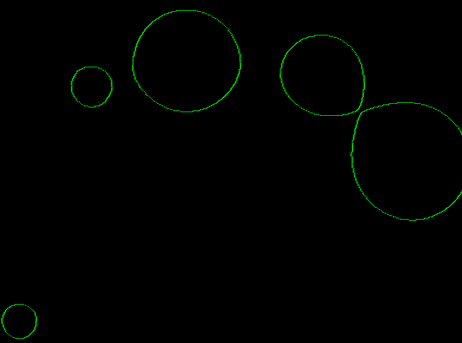
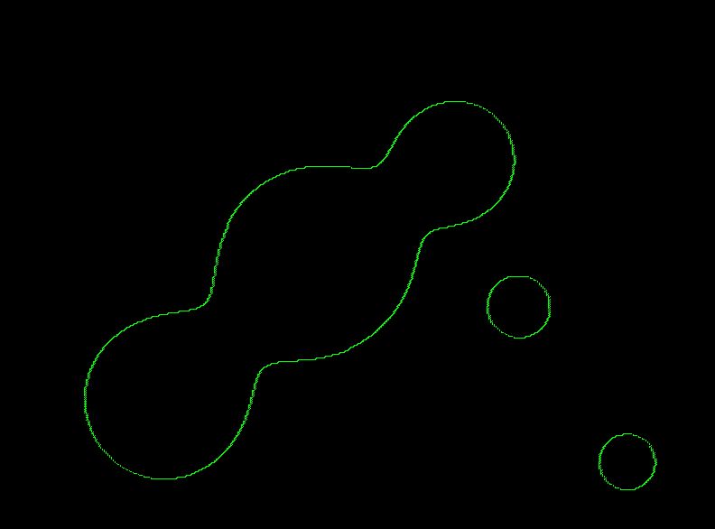

# CUDA Learning

---

​		This is a project for learning torch.utils.cpp_extensions, which includes:

- pytorch and perimeter python libs
- CUDA extension and CUDA parallelism
- C++ export module
- libtorch (interesting conflicts with CUDA, not to mention Eigen)

​		CUDA implemented marching cubes algorithm (2D), **<u>which sucks</u>**, because of the dynamic parallelism and interesting 	CUDA version problem, like when I set:

```python
-gencode=arch=compute_70,code=sm_70
```

​		for nvcc compile arguments, the kernels **<u>won't even execute for unknown reasons</u>**.

​		Also, dynamic parallelism (or nested kernel functions) are not well support by CUDA 10.2 I suppose.

#### Practice I Marching Square Algorithm & SDF calculation

|     Figure 1     |     Figure 2     |
| :--------------: | :--------------: |
|  |  |

